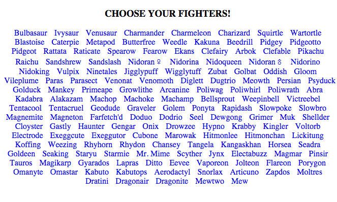
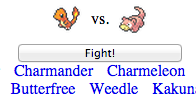
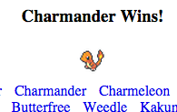

# Pokemon Battle

| **Objectives** |
| :---- |
| Build a simple pokemon battle game in Angular |
| Practice Control logic and Event Binding|
| Consume an external api |

###Instructions:

* **Make sure to `bundle install`.**
* For the moment, our pokemon data lives in `mock_data.js`.
* Can you render all the pokemon names?
* Can you attach an event listener to each name?
* Can you show and hide content based on application state?

Your goal is to build a simple pokemon battle game!

When you're done it should look like this:



You should be able to choose two pokemon:


You should see who won the match:


##Built in Directives
* Repeating
* Hiding and Showing
* Event Binding

##Avoiding "The Flicker"
* What's the difference between:
    `{{ logic in here }}` and `<some_tag some_attribute="logic in here">`?
* What happens when you load the page and you use this:
    ``
* What if `name` doesn't exist yet? (maybe we're waiting on an api response). What will your browser do?

## Promises
Promises are a convenient way of dealing with api callbacks (and other asychronous processes).

Remember this pattern in jQuery?
```
    $.get("SOME_ENDPOINT", function(res){
        // do this when the api responds successfully
    })
```

And this:

```
$.get("SOME_ENDPOINT")
 .success(function(res){
    // do this when the api responds successfully
})
 .fail(function(res){
    // do this when the api fails
})
```

Promises give us new way of dealing with this problem.

1) To do promises _angular-style_, we first need to **inject the `$q` service** into our controller or factory.

2) We can then do the following:

```
function gimmie5() {
  var deffered = $q.defer();

  setTimeout(function(){
    deffered.resolve("FIVE!")   // 5 seconds later...
  }, 5000)

  return deffered.promise;      // returns immediately!
}

gimmie5().then(
  function(response){
      $scope.answer = response;
  }
);
```

But what about api requests? Those aren't always successful. How do we deal with errors? First, let's **inject the `$http` service** and then deal with both _success_ and _error_.

```
function checkWeAreDoomed() {
  var deferred = $q.defer();

  $http
   .get("http://alloworigin.com/get?url=http://www.hasthelargehadroncolliderdestroyedtheworldyet.com") // HACK
   .success(function(response){
      deferred.resolve("NOPE");
    })
   .error(function (rejection) {
      deferred.reject("Ahhhhhh!");
   });

  return deferred.promise;
};

checkWeAreDoomed().then(
  function(response){
      $scope.answer = response; // "NOPE"
  },
  function(rejection){
      $scope.answer = rejection ; // "Ahhhhhh!"
  }
);
```

This pattern becomes waai more important when we're dealing with multiple controllers / models / services.


Reading:

* [ng-cloak](https://docs.angularjs.org/api/ng/directive/ngCloak)
* [ng-src](https://docs.angularjs.org/api/ng/directive/ngSrc)
* [ng-click](https://docs.angularjs.org/api/ng/directive/ngClick)

Bonus reading:
* [What's the difference between the `factory pattern` and the `service pattern`?](http://stackoverflow.com/a/20985702/3390061)
* [Promises are new to ECMASCRIPT 6](https://developer.mozilla.org/en-US/docs/Web/JavaScript/Reference/Global_Objects/Promise)
